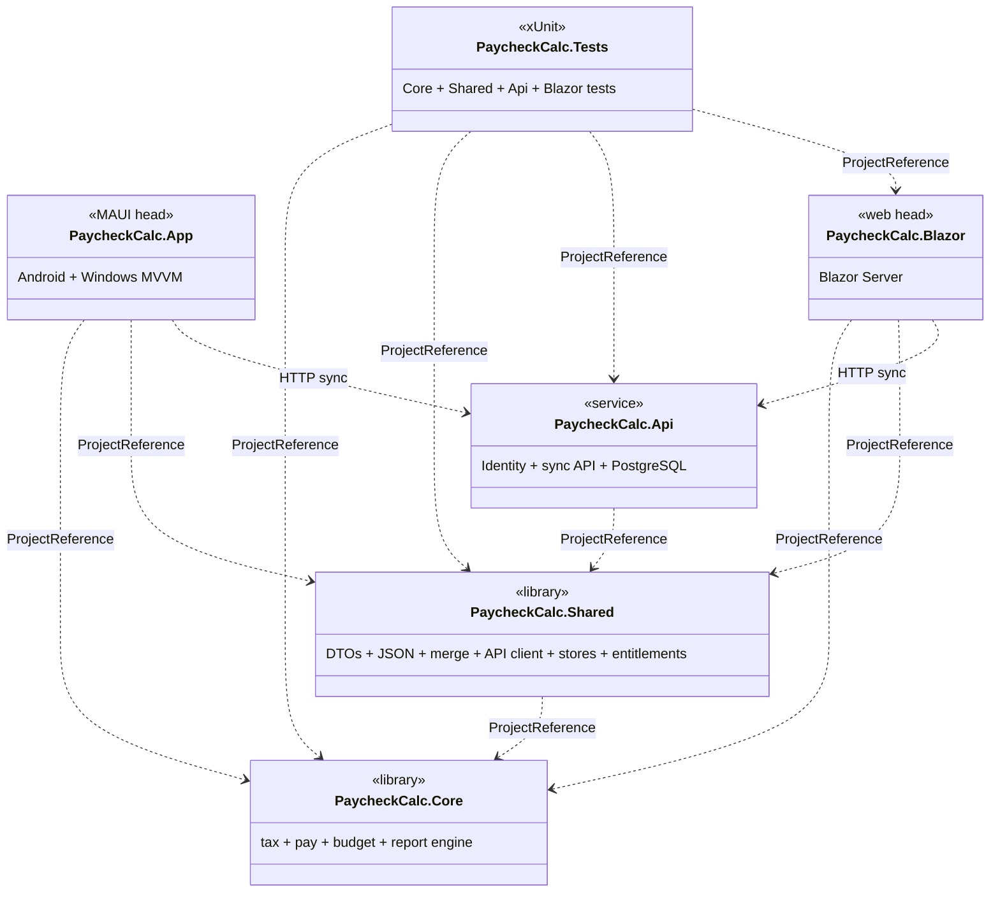
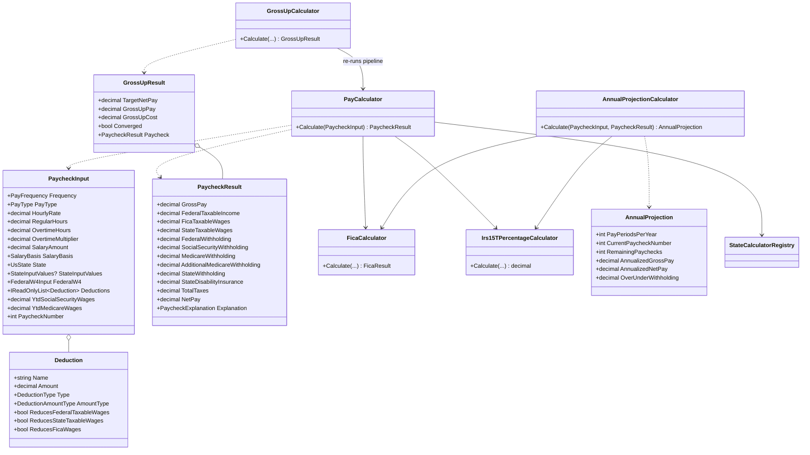
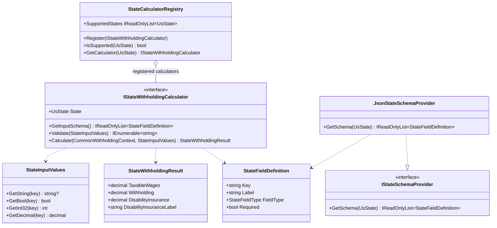
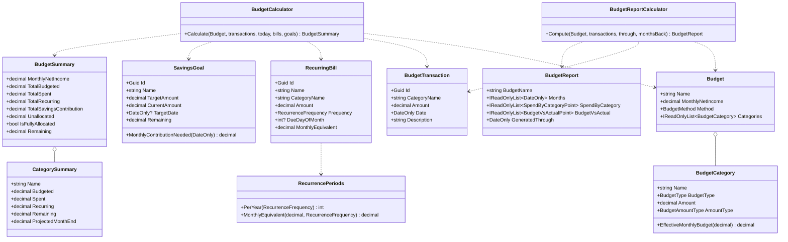
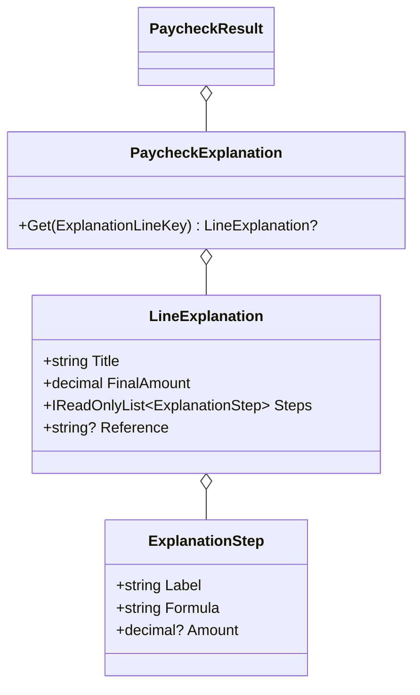
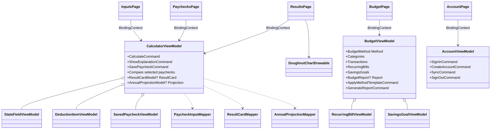
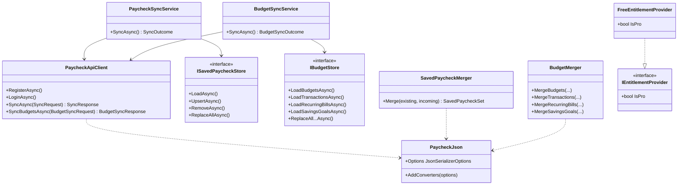
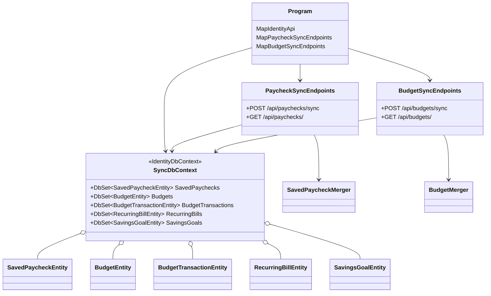

# UML Class Diagram

> High-level Mermaid class diagrams for the current **PaycheckCalc** solution.
>
> These diagrams are architectural rather than exhaustive. State calculators are represented by their shared contracts and registry instead of listing every state class.

## Package Overview

## Core — Paycheck Pipeline

## Core — State Tax Plugin Model

## Core — Budgeting and Reports

## Core — Explanations

## MAUI Head — MVVM Layer

## Blazor Head — Server UI Layer

```mermaid
classDiagram
    direction TB

    class CalculatorRazor["Calculator.razor"] {
        paycheck calculator UI
    }
    class BudgetRazor["Budget.razor"] {
        budget UI + reports
    }
    class HomeRazor["Home.razor"]
    class StateLandingPage
    class DoughnutChart
    class ExplanationModal
    class SessionPaycheckStore
    class SessionBudgetStore
    class StateMetadata
    class FileSystemTaxDataReader
    class PaycheckExportService
    class BudgetReportCsvRenderer
    class BudgetReportPdfRenderer
    class CircuitAccountSession

    CalculatorRazor --> PayCalculator
    CalculatorRazor --> GrossUpCalculator
    CalculatorRazor --> AnnualProjectionCalculator
    CalculatorRazor --> SessionPaycheckStore
    CalculatorRazor --> DoughnutChart
    CalculatorRazor --> ExplanationModal
    BudgetRazor --> BudgetCalculator
    BudgetRazor --> BudgetReportCalculator
    BudgetRazor --> SessionBudgetStore
    BudgetRazor --> BudgetReportCsvRenderer
    BudgetRazor --> BudgetReportPdfRenderer
    StateLandingPage --> StateMetadata
    FileSystemTaxDataReader ..> Core : TaxData files
    CircuitAccountSession ..> PaycheckApiClient
```

## Shared — Sync, Stores, Client, Entitlements

## API — Persistence and Endpoints

