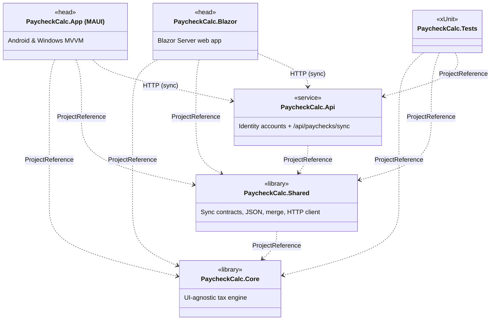
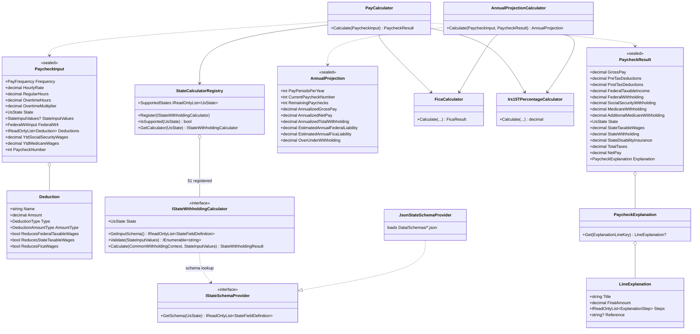
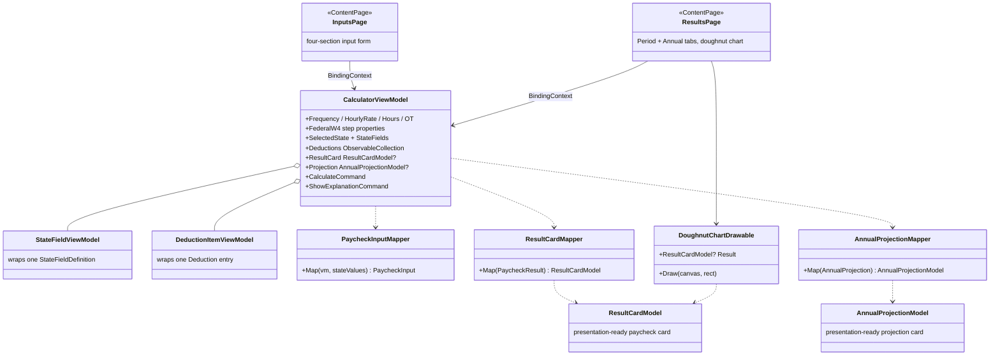

# UML Class Diagram

> High-level Mermaid class diagram for the **PaycheckCalc** solution.
> Render with any Mermaid-compatible viewer (GitHub markdown, VS Code extension, etc.).
>
> The diagram below is intentionally architectural rather than exhaustive: each
> per-state withholding calculator (50 states + DC) implements the
> registry-driven interfaces shown here, so they are elided in favor of the
> contracts and registries that wire them together.

## Package overview

## Core — paycheck pipeline

## MAUI head — MVVM layer

